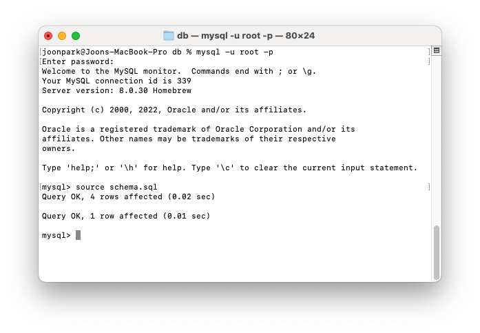

# E-Commerce-Back-End

## Description

[](https://opensource.org/licenses/MIT)

A back end server application that allows the user to build a back end database for an e-Commerce store to track products, categories that products belong to, and tags that the products are associated with.

## Usage

Clone this repo into a local folder. Enter the following node command to install the necessary dependencies:

```Shell
npm install
```

Create an .env file within the repo and enter the following information:

```
DB_NAME='ecommerce_db'
DB_USER='<<insert your mysql username here>>'
DB_PASSWORD='<<insert your mysql password here>>'
```

Then, use mySQL to run the schema.sql file in the db folder to create the database called ecommerce_db.



Then, go back to the root folder and run the following command to seed the database with initial data:

```Shell
node seeds/index.js
```


Then, enter the following command to run the application:

```Shell
node server.js
```


Using an API client such as Insomnia, you are able to create, read, update, and delete (CRUD) tags, categories, and products.


## Walkthrough Video

[Walkthrough Video](https://www.youtube.com/watch?v=RTRgokgZGWQ)

## License

Licensed under the MIT license.